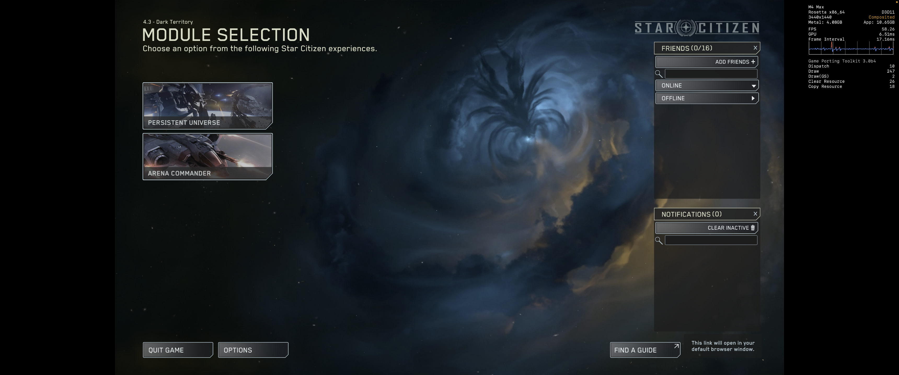

# Star Citizen on macOS (ARM)
This repo is a collection of scripts and configurations for getting Star Citizen to run on macOS M-series processors. This work is experimental and is NOT expected to work right now, since there is currently a blocking issue with EAC. Below are some instructions and included with the repo are scripts for compiling a custom wine version to try and get around the EAC issue. This code is incomplete and requires someone with more knowledge of wine to get building properly. This custom wine version is NOT needed to run Star Citizen, but would be required for getting around the EAC issues. The patches come from the LUG (Linux Users Group), who have been building a custom Wine installation for getting around this EAC problem.

## Crossover
Running star citizen does work with GTPK 3 (Beta 4) and later injected into Crossover 25.1. However, there are some issues with the game's EAC implementation, which prevents the user from logging into the game servers, despite loading to the main menu perfectly fine.

## Current Outstanding Issues
Currently the game will not get past the server login on macOS M-series processors due to the EAC issue. The idea is that if we can incorporate the patches from the LUG into the custom wine version, we may be able to get around the EAC issue. It is expected that once this EAC issue is resolved, the game will be able to run on macOS M-series processors. See the screenshot below:




## Building the Custom Wine Installation

### Prerequisites
Before building the custom Wine installation, you need to install the required dependencies:

### System Requirements
- macOS with Apple Silicon (M1, M2, M3, M4, etc.)
- Xcode Command Line Tools
- GStreamer framework
- Both ARM64 (native) and x86_64 Homebrew installations

### Installing Dependencies

1. **Install Xcode Command Line Tools:**
   ```bash
   xcode-select --install
   ```

2. **Install GStreamer Framework:**
   Download and install the GStreamer runtime and development packages from:
   https://gstreamer.freedesktop.org/download/

3. **Install ARM64 Homebrew (if not already installed):**
   ```bash
   /bin/bash -c "$(curl -fsSL https://raw.githubusercontent.com/Homebrew/install/HEAD/install.sh)"
   ```

4. **Install x86_64 Homebrew (required for Wine build dependencies):**
   ```bash
   arch -x86_64 /bin/bash -c "$(curl -fsSL https://raw.githubusercontent.com/Homebrew/install/HEAD/install.sh)"
   ```

## Building Custom Wine

This repository includes two Wine build scripts targeting different architectures:

### Option 1: ARM64 Native Build (Recommended)
For M-series Macs, use the ARM64 native build which provides better performance:

```bash
cd wine_custom
./buildWine-arm64.sh
```

**What this script does:**
- Downloads Wine 10.15 source code
- Downloads Wine Mono 10.2.0 and Wine Gecko 2.47.4 binaries
- Applies critical EAC compatibility patches:
  - **0003-wined3d-moltenvk-hacks.patch**: MoltenVK integration for Metal support
  - **0006-10.2+_eac_fix.patch**: Names 64-bit loader as `wine64` as expected by EAC
  - **0007-eac_60101_timeout.patch**: Prevents EAC 60101 timeout error by creating proper PID files
- Configures Wine with ARM64-optimized settings including Vulkan and CoreAudio support
- Builds with native Apple Silicon compilation for maximum performance
- Installs Wine with Mono and Gecko runtimes to `install/arm64/`

### Option 2: x86_64 Cross-Compilation Build
For compatibility testing or if you encounter ARM64 build issues:

```bash
cd wine_custom
./buildWine.sh
```

**What this script does:**
- Automatically installs x86_64 Homebrew dependencies
- Uses x86_64 cross-compilation with MinGW-w64
- Applies the same EAC compatibility patches
- Builds Wine for x86_64 architecture with Rosetta translation
- Installs Wine with Mono and Gecko runtimes to `install/aarch64/`

### Build Configuration Details

Both build scripts configure Wine with:
- **Vulkan Support**: For DirectX to Vulkan translation via DXVK
- **MoltenVK Integration**: Vulkan to Metal translation for macOS
- **CoreAudio**: Native macOS audio support
- **EAC Patches**: Critical patches for Easy Anti-Cheat compatibility
- **MinGW Cross-compilation**: For Windows PE executable support
- **No X11 Dependencies**: Pure macOS build without Linux dependencies

### Build Output

After successful compilation, Wine will be installed to:
- ARM64 build: `wine_custom/install/arm64/wine-10.15/`
- x86_64 build: `wine_custom/install/aarch64/wine-10.15/`

The installation includes:
- Wine binaries and libraries
- Wine Mono runtime (for .NET applications)
- Wine Gecko runtime (for HTML/web content)
- All necessary supporting files

### Troubleshooting Build Issues

**Common build problems:**

1. **Missing x86_64 Homebrew**: The x86_64 build script will auto-install dependencies, but you need x86_64 Homebrew first.

2. **GStreamer Framework Missing**: Install from the official GStreamer website, not Homebrew.

3. **Patch Application Failures**: Ensure you're using the correct Wine version (10.15) that matches the patches.

4. **Build Timeouts**: Wine compilation is CPU-intensive. Ensure adequate cooling and power for your Mac.

5. **MinGW-w64 Issues**: The x86_64 build requires MinGW cross-compilers which are automatically installed.

## Usage
